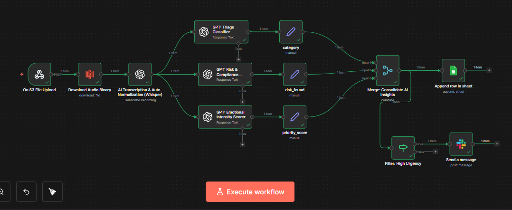

# VoiceOps-Intelligence-Engine (n8n + OpenAI)

## 📌 Project Overview
The **VoiceOps-Intelligence-Engine** is a production-grade asynchronous media processing and business intelligence pipeline. Built using **n8n**, **OpenAI (Whisper & GPT-4o)**, **Google Sheets**, and **Slack**, it transforms raw voice data into structured, actionable insights.


The system doesn't just transcribe; it acts as a "Digital Supervisor"—analyzing every recording for intent, priority, and legal compliance before routing the data to the appropriate stakeholder.

---



## 🎯 Business Problem
In high-volume environments like Support Centers or Legal Clinics, audio data is often a "dark liability":
- **Information Overload:** Managers cannot listen to every call to find critical issues.
- **Delayed Intervention:** Legal threats or high-priority cancellations are buried in a chronological queue.
- **Data Inconsistency:** Manual logging of call "sentiment" is subjective and slow.
- **The "Blindspot" Risk:** Missing a "threat to sue" or a "refund request" for 48 hours can lead to churn or litigation.

---

## ✅ Solution
This engine implements a **Parallel Intelligence Architecture** to bridge the gap between raw audio and business action:
- **Asynchronous Intake:** Offloads heavy transcription tasks to OpenAI Whisper as a background process.
- **Multi-Model Triage:** Simultaneously forks data into three AI "Auditors" to detect Category, Urgency (1-10), and Legal Risk.
- **Data Synthesis:** Utilizes a **Merge Node** to synchronize disparate AI outputs into a unified "Intelligence Object."
- **Persistent Logging:** Updates a **Google Sheets** dashboard for long-term trend analysis and audit trails.
- **Real-Time Alerting:** Employs an **IF-Node Router** to trigger instant **Slack** notifications for any case flagged as `Legal Risk: True` or `Priority >= 8`.

---

## 🛠️ Tech Stack
- **n8n** – Workflow orchestration and complex logic branching.
- **OpenAI (Whisper)** – Neural speech-to-text conversion.
- **OpenAI (GPT-4o)** – Sentiment analysis and compliance auditing.
- **Google Sheets** – Centralized database for persistent logging.
- **Slack API** – Real-time incident response and notification.
- **JavaScript/JSON** – Advanced data parsing and regex sanitization.

---

## 🔄 Workflow Architecture

### 1️⃣ The Engine (Transcription)
Converts raw audio binary into searchable text using Whisper.

### 2️⃣ The Intelligence Layer (Parallel Processing)
Forks the data into three specialized AI nodes for granular analysis:
- **Triage:** Determines intent (e.g., Support, Billing, Legal).
- **Urgency Score:** Calculates a 1-10 priority level based on customer sentiment.
- **Risk Audit:** Specifically scans for litigation and compliance-related keywords.


### 3️⃣ The Synthesis (Merging)
Uses a **Merge Node** (Combine by Position) to synchronize the three AI streams, ensuring the workflow only proceeds once a complete "Business Intelligence Packet" is formed.

### 4️⃣ The Router (Operational Action)
- **Log Path:** Records 100% of data to Google Sheets for historical reporting.
- **Alert Path:** Filters for high-priority triggers to send a formatted Slack Alert.

---

## 🤖 AI Logic & Defensive Programming
A core feature of this project is its **resilience against AI hallucination and formatting errors**:
- **Markdown Sanitization:** Custom JavaScript logic to strip backticks (`` ```json ``) and text artifacts from AI responses.
- **Type-Safe Logic:** Uses defensive `==` equality checks to handle both Boolean and Stringified-Boolean responses from LLMs.
- **Human-Centric Formatting:** Employs ternary operators to convert raw data into visual status indicators (🔴/🟢) for immediate recognition by humans in Slack.

---

## 🚀 Key Achievements
- **Reduced Response Time:** Critical legal threats are flagged in < 60 seconds.
- **Structural Integrity:** Solved complex "Type Mismatch" errors between AI outputs and downstream SaaS APIs.
- **Scalability:** Designed a non-blocking architecture that can handle multiple simultaneous audio files without system timeouts.

---

## 📚 What I Learned
- **Parallel Execution:** Managing multiple API calls simultaneously to optimize execution speed.
- **Regex & Data Cleaning:** Mastered the art of "cleaning" messy AI output for reliable software consumption.
- **Enterprise Routing:** Designing logic that automates "escalation" based on data-driven business triggers.

---

## 👤 Author
**Adeola Olagbenro** Automation Engineer / Workflow Developer
